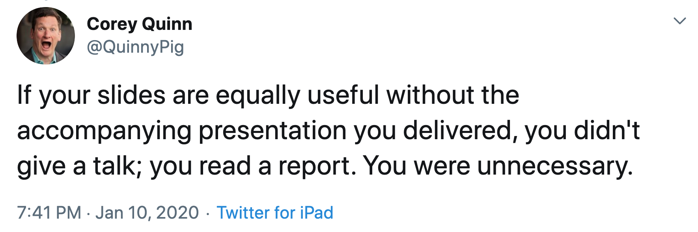
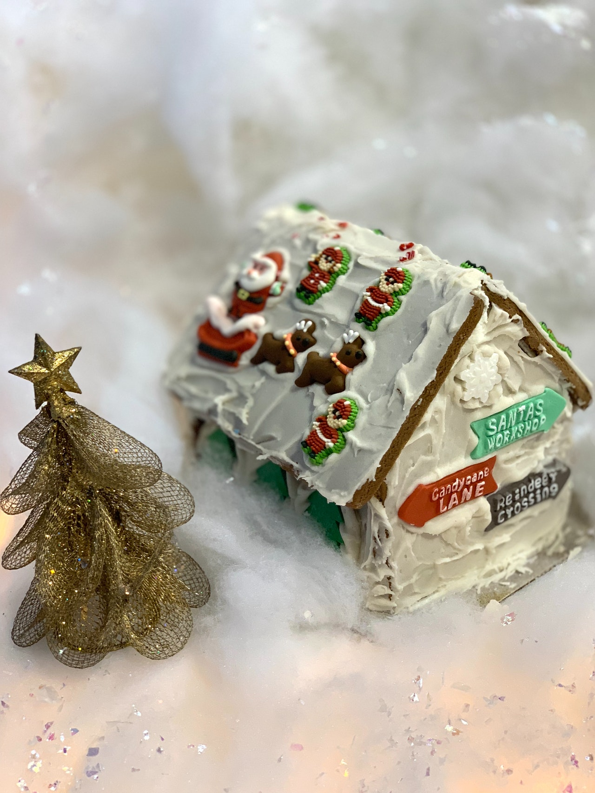

theme: Ostrich, 1

# Making Slides
## Telling Stories

### @garyfleming

^ My name is... I am a...

---

^ Started making slides. Saw this tweet.
Snarky but true.
Presentations are a poor way of dumping info that might be better held in a blg post. Written information is great for accuracy, detail, and reference.

---

# You!

^ So why give a talk?
It's about *you* and your perspective and your story. What you'll bring to it, What you know, who you are. etc
(some might think their opinion doesn't matter)

---

* You're telling a story.
* Slides should help, not tell the story.

^  Want slides that help us tell the story. but are NOT the story.
Want slides that don't get in the way of story telling. That's what this is about
So that's what we're going to work on for the next wee bit.

---

# This is not about...

^ Literally make slides. There are tonnes of tools you can use: PPT, Google Slides, deckset etc. They're pretty straightforward with good defaults. Spend some time figuring those out.

---

# Discussion
## Bad Slides

---

A mean wolf wants to eat the girl, and the food in the basket. He secretly stalks her behind trees and bushes and shrubs and patches of little grass and patches of tall grass. He approaches Little Red Riding Hood and she naïvely tells him where she is going. He suggests the girl pick some flowers, which she does. In the meantime, he goes to the grandmother's house and gains entry by pretending to be the girl. He swallows the grandmother whole, and waits for the girl, disguised as the grandma.

^ Read this very quickly. Discuss in pairs whats wrong. What you might change.
... What happens if you do this?

---

* The famine comes to rural Germany.
* Woodcutter's wife wants to send kids, Hansel & Gretel away.
* Kids get lost in the woods and find a gingerbread house.
* Witch traps them and fattens them up for eating.
* Gretel tricks witch into getting into oven.
* Kids live happily ever after

^ Group. What;s up?
... Still quite busy. Still a lot of text.

---

 
 
 

^ Busy. Too much. Doesn't really tell you anything while trying to tell you everything

---

# Story Arcs

^ To

---

# Beginning...

^ Stories have a beginning. Introduce a problem. Characters. What the whole thing is about... maybe.

---

# ... Middle...

^ The journey. Things we encounter. Challenges we see and overcome. The fun stuff,

---

# ... Conflict?

^ Unexpected conflict! Something didn't work. Plan fell apart. Hope is lost. The Unexpected trips us up. (Stories without flaws miss important parts)

---

# ... Inspiration!

^ Unexpected inspirtation appears to help us resolve conflict and overcome adversity.

---

# ... End

^ Happily ever after. Conclusions. Thinks we learned. Where we are now and why that's better.

---

# Not quite that simple...

^ Multiple ups and downs. Switches between different feels to keep it interesting, without being incoherent.

---

# Exercise
## Little Red Riding Hood

1. Main points of the story as a list...
2. 5 essential beats to tell the story.
3. Index cards as slides -- visual, text, either, both
4. Feedback

---

# Thank You

@garyfleming
